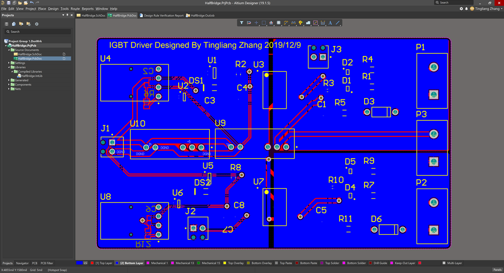

FF150R12RT4 IGBT半桥驱动电路设计

张庭梁

##### 要求：

针对FF150R12RT4这款IGBT半桥模块，基于HCPL-316J光耦驱动芯片，设计一款半桥驱动电路。要求采用隔离电源，参考型号为NMH0515SC；基于光耦芯片自身特性，电路具备短路保护功能；输入电压为5V，IGBT驱动电压为正负15V。

 

##### 电路设计思路

 

Rg = 10 Ω

 

故障诊断电路

output pull-down resistor：下拉，安全考虑

DESAT pin protection resistor：100ohm——限流

FAULT pin capacitor：稳定纹波——防止误保护

FAULT pin pull up resistor——OC，上拉，稳定电位

二极管：UF7007——快速，压降调整

 

##### 原理图电路设计

 

 

注：驱动芯片用的封装NCS1S1205SC和实际使用的元件NCS1S1205SC引脚定义不一致，故按照datasheet上的引脚定义连接。在PCBdoc里面就是正确的了。

 

 

光线接受端子电路

此电路作用是接受控制电路发送的光驱动信号将其转换为电信号。电路是参考所用器件Datasheet推荐的电路。其中C1电容的作用是退耦，取值参考Datasheet。

光纤接受端子电路

 

电路主要是参考HCPL-316J-000E的Datasheet中的推荐电路进行设计

 

 

 

反相器

 

 当HCPL-316J检测到故障时，其故障输出反馈段（Fault）呈现低电平，端子的前卫二极管（发光二极管）导通，然后拉低HCPL-316J的VIN+引脚输入信号，使其前卫在低电平，从而VIN-引脚上的驱动信号无法输入到HCPL-316J内，在低一时间联锁了所有ACPL-34JT的输入，使IGBT失去驱动信号从而停止工作，故达到故障保护的作用。FAULT信号的引出用于输出到板外以提示故障出现。

 

器件选择

| 器件                            | 选型        | 备注                                                         |
| ------------------------------- | ----------- | ------------------------------------------------------------ |
| IGBT驱动芯片                    | HCPL-316J   | 作业要求                                                     |
| 光纤接受端子                    | HFBR2521Z   | 课上ppt推荐                                                  |
| IGBT模块                        | FF150R12KS4 | 62mm封装；  半桥模块；  VCES = 1200V, Ic = 150A，  满足作业要求。 |
| 单反向门   Single Inverter Gate | NC7S04M5X   | 用于实现ACPL-34JT输入驱动信号的负逻辑和缓冲；                |
| 超快恢复二极管                  | MURA160     | 反向耐压600V，串联可得到反向耐压1200V，实现IGBT最大工作电压1200V的目标 |
| DC-DC电源模块                   | NCS1S1205SC | 5V转+-15V，以满足IGBT栅极输入电压的要求。                    |
| 二极管                          | BAS20HT1G   | High Voltage Switching Diode, 2-Pin  SOD-323, Pb-Free, Tape and Reel  200V 500mA |
| 其他器件                        | -           | 参考Datasheet 的推荐值                                       |

 

三、PCB设计

本作业设计的板子所设计的板子是双层板。其布局主要分为三个部分，左边的是驱动信号，右边是驱动电压，其中右边上下分别对应上下管子的驱动。

 

强电布线

 

弱电布局

 

定义外形后：

 

铺铜之后：

 

 

 

3D视图：

V2.0更改：

 

上下两路+-15V驱动分离，两路驱动

光纤端子下拉电阻

故障信号低电平输出

 

 

 

 

一些反思：

 

这次布局没有搞好，强电/供电应该在一起。

同时供电和DGND可以通过铺铜连接，一开始布线可以先不考虑

Manufactured part search是个好东西。